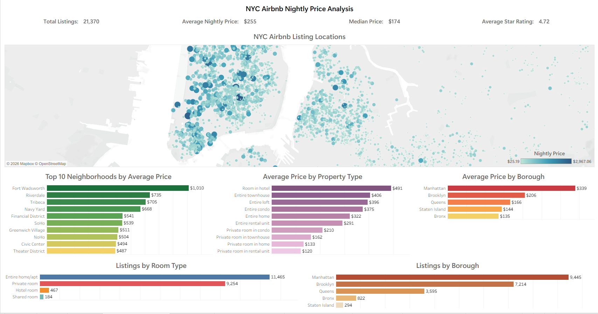

# NYC Airbnb Market Analysis Dashboard

Interactive Tableau dashboard analyzing more than 21,000 Airbnb listings across New York City to compare nightly prices, identify geographic pricing patterns, examine property characteristics, and explore differences across boroughs and room types.

---

## Tableau Dashboard 

---

## Business Problem

New York City's Airbnb market contains thousands of listings with varying prices, property types, locations, and guest ratings. Without an interactive dashboard, it can be difficult to identify pricing trends, compare neighborhoods, or understand how listing characteristics influence nightly rates.

This project transforms raw Airbnb listing data into an interactive business intelligence dashboard that helps users quickly explore pricing patterns, neighborhood performance, and listing distribution across New York City.

---

## Project Objectives

The dashboard was designed to answer questions such as:

- Which boroughs have the highest average nightly prices?
- Which neighborhoods are the most expensive?
- How do prices differ by property type?
- How are listings distributed across New York City?
- Which room types are most common?
- What is the typical nightly price across the market?

---

## Dataset

- **Source:** Inside Airbnb
- **Location:** New York City
- **Original Dataset Size:** Approximately 30,000 listings
- **Final Dataset Size:** 21,370 listings after data cleaning

---

## Tools Used

- Python
- Pandas
- Jupyter Notebook
- Tableau
- Microsoft Excel

---

## Data Cleaning

The original dataset contained numerous missing fields, unused metadata, inconsistent data types, and unrealistic listing prices. The dataset was cleaned in Python before being imported into Tableau.

Cleaning steps included:

- Imported compressed Airbnb listing data using Pandas.
- Removed columns containing no usable information.
- Removed unnecessary metadata that was not relevant for dashboard analysis.
- Converted price values from text format into numeric values.
- Removed listings with missing nightly prices.
- Filtered unrealistic nightly prices by keeping listings between **$25 and $3,000**.
- Exported the cleaned dataset for Tableau visualization.

---

## Dashboard Features

### Executive KPIs

- Total Listings
- Average Nightly Price
- Median Nightly Price
- Average Review Rating

### Interactive Map

Displays the geographic distribution of Airbnb listings throughout New York City.

Marker size and color represent nightly price, making it easy to identify higher-priced areas.

### Average Price by Borough

Compares average nightly prices across:

- Manhattan
- Brooklyn
- Queens
- Bronx
- Staten Island

### Top Neighborhoods by Average Price

Ranks the neighborhoods with the highest average nightly prices.

### Average Price by Property Type

Compares pricing across different accommodation types including:

- Entire homes
- Apartments
- Private rooms
- Condominiums
- Hotels
- Townhouses

### Listings by Room Type

Shows the distribution of listings between:

- Entire home/apartment
- Private room
- Hotel room
- Shared room

### Listings by Borough

Compares listing volume across New York City's five boroughs.

### Review Rating Distribution

Visualizes how guest ratings are distributed across listings.

---

## Key Insights

- Manhattan has the highest average nightly prices among all boroughs.
- Brooklyn contains the second largest concentration of listings while maintaining lower average prices than Manhattan.
- Entire homes and hotel rooms generally command higher nightly rates than private or shared rooms.
- Listing prices vary substantially across neighborhoods.
- Most Airbnb listings receive strong guest ratings.
- The majority of listings are concentrated in Manhattan and Brooklyn.

